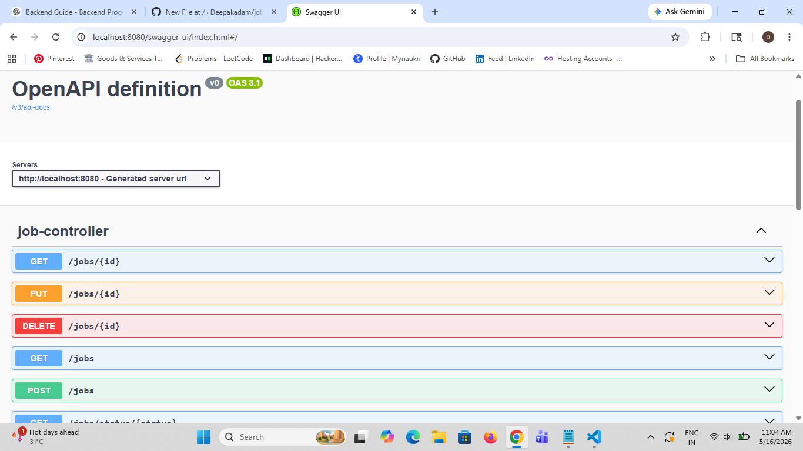

# JobTracker Backend API 🚀

A production-style Spring Boot backend project for tracking job applications.

## 🔥 Features

- User Authentication with JWT
- Spring Security
- CRUD APIs
- Pagination
- Sorting
- Search APIs
- Validation
- Global Exception Handling
- Swagger API Documentation
- MySQL Database Integration

---

## 🛠 Tech Stack

- Java 17
- Spring Boot
- Spring Security
- Spring Data JPA
- JWT
- MySQL
- Maven
- Swagger / OpenAPI
- Postman

---

## 📌 API Modules

### Auth APIs
- Register User
- Login User
- JWT Token Generation

### Job APIs
- Create Job
- Get All Jobs
- Get Job By ID
- Update Job
- Delete Job
- Search By Status
- Pagination
- Sorting

---

## 🔐 Security

- JWT-based authentication
- BCrypt password encryption
- Stateless session management

---

## 📖 Swagger Documentation

```text
http://localhost:8080/swagger-ui/index.html
```

---

## ▶️ Run Project

```bash
mvn spring-boot:run
```

---

## 👩‍💻 Developed By

Deepa Kadam

## 📸 Project Screenshot


